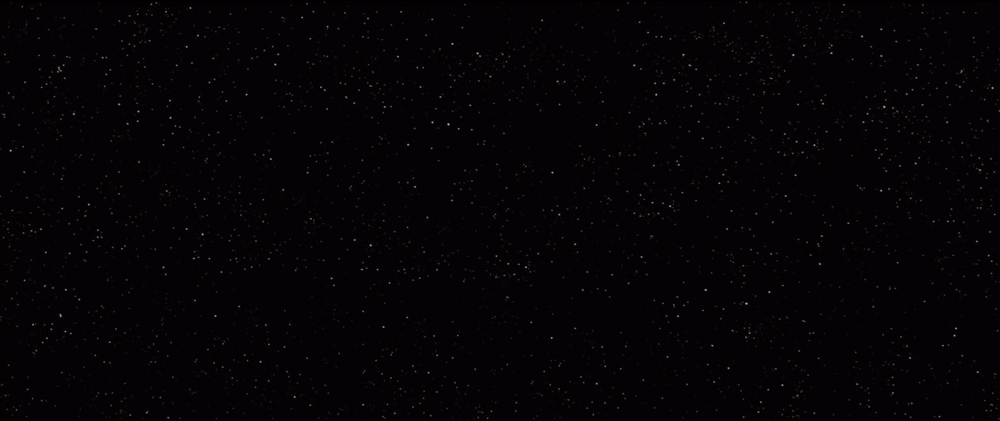

# 星球大战css3特效开发
- 学习的目的在于不断设计能力的增长点
  1. 黑客
  2. html/css/js 离开API
   - 写html结构
     emmet 快速完成 热门专栏写法变了 
  3. markdown语法格式
  [百度](http://www.baidu.com)
  
  4. 基础
- 学习愿景 
  代码世界的导演  html/css/js
  1. 图片 演员
    背景图片 background repeat
     star   wars 
  2. 布局
  定位到相应地方 
  css 动画
  - 居中做法
  1. 先绝对定位，中心点作为左上角
  2. 向左移自身宽度的一半，向上移自身高度的一半 transform：translate(-50%,-50%)
- 开发素养
  1. 工具思维
  2. -emmet
   快，使用css选择器，快速输入html
   >选择子元素
   + 兄弟节点
   div可以省略
   []属性选择器
   -文件访问
   网络访问 本地 
   背景调色